# Solución: Extender el objeto `Request` de Express en TypeScript

A menudo fascinado por la creación de mis propias API's, quise esta vez crear mis propios "middleware". Después de investigar por dos días, encontré la solución para agregar propiedades personalizadas al objeto `Request` de Express en TypeScript. Aquí el resumen técnico:

---

## 🔍 El Problema
Al intentar agregar una propiedad personalizada al objeto `Request`:

<strong>index.ts</strong>
```typescript
app.use(userMiddleware); // ❌ Ninguna sobrecarga coincide con esta llamada.

app.get("/", (req, res) => {
  if (req.datosUsuario) {
    res.send(`ID: ${req.datosUsuario.id}, Nombre: ${req.datosUsuario.nombre}`);
    // ❌ La propiedad 'datosUsuario' no existe en el tipo 'Request...'
  } else {
    res.status(500).send("Error interno");
  }
});
```

<strong>middleware.ts</strong>
```typescript
import { Request, Response, NextFunction } from "express";

export const userMiddleware = (
  req: Request,
  res: Response,
  next: NextFunction,
): void => {
  req.datosUsuario = {
    id: 1,
    nombre: "Juan",
  };
  next();
};
```

<strong>@types/express.d.ts</strong>
```typescript
import "express";

declare module "express" {
  export interface Request {
    datosUsuario: {
      id: number;
      nombre: string;
    };
  }
}
```

#### Al compilar ⛔
```html
<section style="font: .9rem 'Courier', sans-serif">
<p>
<span style="color:#00ff00">user@hostname</span> <span style="color:violet">MINGW64</span> <span style="color:#ffff00">~/MyMiddleware</span><br />
</p>
<p>
<span style="font-size:.5em">❌</span>$ npm run build<br />
&nbsp;> app@1.0.0 build<br />
&nbsp;> tsc --build
</p>
<p>
<span style="color:#0090de">src/index.ts</span>:<span style="color:#ffff00">11:11</span> - <span style="color:#ff5555">error TS2339</span>: Property 'datosUsuario' does not exist on type 'Request<{}, any, any, ParsedQs, Record<string, any>>.
</p>
</section>
```

## 🛠️ La Solución
<strong>@types/express.d.ts</strong>
```typescript
import "express";

declare global {
  namespace Express {
    interface Request {
      datosUsuario?: {
        id: number;
        nombre: string;
      };
    }
  }
}
```

<strong>tsconfig.jon</strong>
✅ Se debe incluir los tipos
```JSON
{
  "compilerOptions": {
    // ... otras configuraciones
    "typeRoots": [
      "./node_modules/@types",
      "./@types"
    ]
  },
  "include": [
    "src/**/*",
    "@types/**/*"
  ]
}
```

## 🛟Conclusión
Para extender Request en TypeScript:

1. Crea declaraciones de tipos en @types/express.d.ts
2. Configura typeRoots y include en tsconfig.json
3. ¡Usa tus propiedades sin miedo a los tipos!

```mermaid
graph TD
    A[📦 MyMiddleware] --> B(📂 @types/)
    B --> C(📄 express.d.ts)
    A --> D(📂 dist/)
    A --> E(📂 node_modules/)
    A --> F(📂 src/)
    F --> G(📄 index.ts)
    F --> H(📄 middleware.ts)
    A --> I(📄 tsconfig.json)
    A --> J(📄 package.json)
    A --> K(📄 package-lock.json)
```




---

⚠️ Importante: Verifica que tu directorio @types esté en la raíz del proyecto.

---

